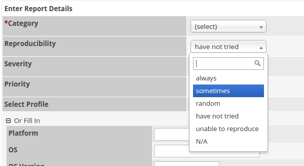

# Chosen plugin for MantisBT
Chosen is a jQuery plugin that makes long, unwieldy select boxes much more user-friendly.

## Description
Chosen is a jQuery plugin that makes long, unwieldy select boxes much more user-friendly. This plugin is a optional enhancement for the MantisBT Theme [Colorized](https://github.com/bueltge/MantisBT-Colorized).

[Mantis Bug Tracker](http://www.mantisbt.org/) (MantisBT) is a free popular web-based bugtracking system.

## Screenshot
A example in MantisBT with active Chosen plugin and Theme [Colorized](https://github.com/bueltge/MantisBT-Colorized)

## Installation
 1. Just unpack (only folder `chosen`) in MantisBT_Root_Folder/plugins/
 2. The plugin use the jquery library. If you use MantisBT smaller 1.3, then is the [jQuery Plugin](https://github.com/mantisbt-plugins/jquery) necassery.
 3. Activate MantisBT Chosen Plugin
 4. Done ;)

## Other Notes
### Version/Changelog
See in VERSION.txt

### License
Good news, this plugin is free for everyone! Since it's released under the MIT. But if you enjoy this plugin, you can thank me and leave a [small donation](http://bueltge.de/wunschliste/ "Wishliste and Donate") for the time I've spent writing and supporting this plugin. And I really don't want to know how many hours of my life this plugin has already eaten ;)

### Contributors
see the [contributors graph](https://github.com/bueltge/Chosen-for-MantisBT/graphs/contributors) for the current status

### Contact & Feedback
The plugin is designed and developed by me ([Frank Bültge](http://bueltge.de))

Please let me know if you like the plugin or you hate it or whatever ... Please fork it, add an issue for ideas and bugs.

### Disclaimer
I'm German and my English might be gruesome here and there. So please be patient with me and let me know of typos or grammatical farts. Thanks
